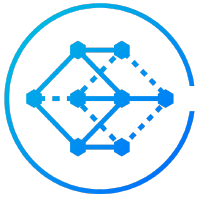
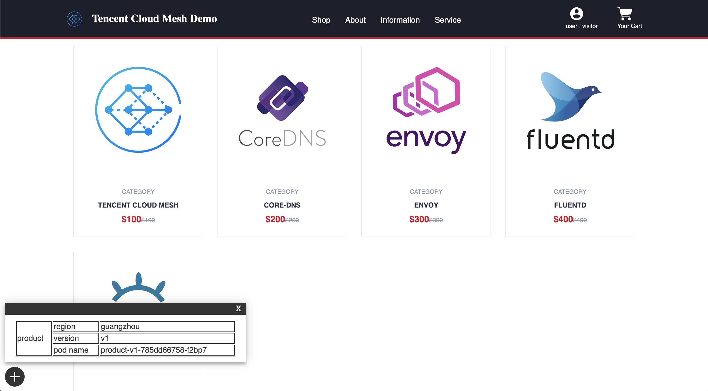

<div id="top"></div>


[![Contributors][contributors-shield]][contributors-url]
[![Forks][forks-shield]][forks-url]
[![Stargazers][stars-shield]][stars-url]
[![Issues][issues-shield]][issues-url]
<!-- [![Apache License][license-shield]][license-url] -->


<!-- PROJECT LOGO -->
<br />
<div align="center">
  <a href="https://github.com/Tencent-Cloud-Mesh/mesh-demo">
    
  </a>

<h3 align="center">mesh demo</h3>

  <p align="center">
    A demo helps you have a quick start to Tencent Cloud Mesh
  </p>
</div>


<!-- TABLE OF CONTENTS -->
<details>
  <summary>Table of Contents</summary>
  <ol>
    <li>
      <a href="#about-the-project">About The Project</a>
      <ul>
        <li><a href="#built-with">Built With</a></li>
      </ul>
    </li>
    <li>
      <a href="#getting-started">Getting Started</a>
      <ul>
        <li><a href="#prerequisites">Prerequisites</a></li>
        <li><a href="#installation">Installation</a></li>
      </ul>
    </li>
    <li><a href="#usage">Usage</a></li>
    <li><a href="#roadmap">Roadmap</a></li>
    <li><a href="#contributing">Contributing</a></li>
    <li><a href="#license">License</a></li>
    <li><a href="#contact">Contact</a></li>
    <li><a href="#acknowledgments">Acknowledgments</a></li>
  </ol>
</details>


<!-- ABOUT THE PROJECT -->
## About The Project



This repo contains the source code of apps and the yamls of kubernetes, which can help you have a quick start to TCM.

<p align="right">(<a href="#top">back to top</a>)</p>


### Built With

* [Golang](https://nextjs.org/)
* [Docker](https://angular.io/)
* [Docker-Compose](https://svelte.dev/)
* [Python](https://laravel.com)
* [React.js](https://reactjs.org/)
* [Nginx](https://vuejs.org/)

<p align="right">(<a href="#top">back to top</a>)</p>


<!-- GETTING STARTED -->
## Getting Started

Here is a startup yaml config of tcm demo, please check it out [here](yamls/step01-apps-zone-a.yaml). 

Notice that change to the correct branch or tag according to your istio version!

For example, if you want to use the `latest version` of istio supported in Tencent Cloud Mesh, you can just use the yamls in master branch. And if you want to use `istio 1.8.1`, please use the yamls in the `branch 1.8.1` or in the `tag 1.8.1`.

### Prerequisites

You should have a TKE cluster before everything, please check it out [Here](https://cloud.tencent.com/product/tke)

### Installation

#### Use kubectl
+ Use kubectl to Login to the TKE cluster
+ Use kubectl to submit yaml to cluster
```bash
  kubectl apply -f yamls/step01-apps-zone-a.yaml
```
#### Use Web Console in TKE
In this way, you just need to copy the yaml to the web console in TKE.

1. Get a free API Key at [https://example.com](https://example.com)
2. Clone the repo
   ```sh
   git clone https://github.com/Tencent-Cloud-Mesh/mesh-demo.git
   ```
3. Install NPM packages
   ```sh
   npm install
   ```
4. Enter your API in `config.js`
   ```js
   const API_KEY = 'ENTER YOUR API';
   ```

<p align="right">(<a href="#top">back to top</a>)</p>


<!-- USAGE EXAMPLES -->
## Usage

Use this space to show useful examples of how a project can be used. Additional screenshots, code examples and demos work well in this space. You may also link to more resources.

_For more examples, please refer to the [Documentation](https://example.com)_

<p align="right">(<a href="#top">back to top</a>)</p>


<!-- ROADMAP -->
## Roadmap

- [] Feature 1
- [] Feature 2
- [] Feature 3
    - [] Nested Feature

See the [open issues](https://github.com/Tencent-Cloud-Mesh/mesh-demo/issues) for a full list of proposed features (and known issues).

<p align="right">(<a href="#top">back to top</a>)</p>


<!-- CONTRIBUTING -->
## Contributing

Contributions are what make the open source community such an amazing place to learn, inspire, and create. Any contributions you make are **greatly appreciated**.

If you have a suggestion that would make this better, please fork the repo and create a pull request. You can also simply open an issue with the tag "enhancement".
Don't forget to give the project a star! Thanks again!

1. Fork the Project
2. Create your Feature Branch (`git checkout -b feature/AmazingFeature`)
3. Commit your Changes (`git commit -m 'Add some AmazingFeature'`)
4. Push to the Branch (`git push origin feature/AmazingFeature`)
5. Open a Pull Request

<p align="right">(<a href="#top">back to top</a>)</p>


<!-- LICENSE -->
## License

Distributed under the MIT License. See `LICENSE.txt` for more information.

<p align="right">(<a href="#top">back to top</a>)</p>


<!-- CONTACT -->
## Contact

Your Name - [@twitter_handle](https://twitter.com/twitter_handle) - email@email_client.com

Project Link: [https://github.com/Tencent-Cloud-Mesh/mesh-demo](https://github.com/Tencent-Cloud-Mesh/mesh-demo)

<p align="right">(<a href="#top">back to top</a>)</p>


<!-- ACKNOWLEDGMENTS -->
## Acknowledgments

* []()
* []()
* []()

<p align="right">(<a href="#top">back to top</a>)</p>


<!-- MARKDOWN LINKS & IMAGES -->
<!-- https://www.markdownguide.org/basic-syntax/#reference-style-links -->
[contributors-shield]: https://img.shields.io/github/contributors/Tencent-Cloud-Mesh/mesh-demo.svg?style=for-the-badge
[contributors-url]: https://github.com/Tencent-Cloud-Mesh/mesh-demo/graphs/contributors
[forks-shield]: https://img.shields.io/github/forks/Tencent-Cloud-Mesh/mesh-demo.svg?style=for-the-badge
[forks-url]: https://github.com/Tencent-Cloud-Mesh/mesh-demo/network/members
[stars-shield]: https://img.shields.io/github/stars/Tencent-Cloud-Mesh/mesh-demo.svg?style=for-the-badge
[stars-url]: https://github.com/Tencent-Cloud-Mesh/mesh-demo/stargazers
[issues-shield]: https://img.shields.io/github/issues/Tencent-Cloud-Mesh/mesh-demo.svg?style=for-the-badge
[issues-url]: https://github.com/Tencent-Cloud-Mesh/mesh-demo/issues
<!-- [license-shield]: https://img.shields.io/badge/License-Apache%202.0-blue.svg
[license-url]: https://github.com/Tencent-Cloud-Mesh/mesh-demo/LICENSE
[linkedin-shield]: https://img.shields.io/badge/License-Apache%202.0-blue.svg
[linkedin-url]: https://linkedin.com/in/linkedin_username
[product-screenshot]: images/screenshot.png -->
